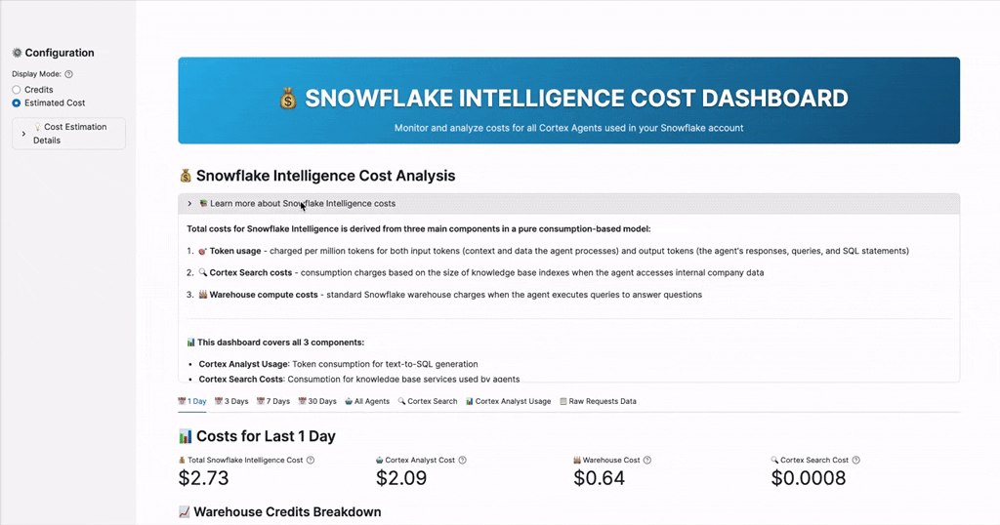

# 💰 Snowflake Intelligence Cost Dashboard

A comprehensive Streamlit dashboard for monitoring and analyzing costs associated with Cortex Agents and Snowflake Intelligence in your Snowflake account.



## 📊 What This Dashboard Does

This dashboard provides comprehensive cost monitoring for all Cortex Agents in your Snowflake account, tracking Cortex Analyst text-to-SQL generation costs, warehouse compute costs for AI-generated query execution, and Cortex Search costs for knowledge base services across multiple time periods (1d, 3d, 7d, 30d). The dashboard shows total consumption with detailed breakdowns by warehouse usage, agent configurations, search service mapping, usage trends over time, and raw request data, while automatically detecting your Snowflake edition to provide both credit consumption and estimated dollar cost views.

### ⚠️ Important: Orchestration & Reasoning Costs

In early November 2024, Snowflake announced new cost components for Cortex Agents:
- **Orchestration costs** - Credits for agent workflow coordination and tool calling
- **Reasoning costs** - Credits for agent decision-making and planning

These costs are **not yet available** in ACCOUNT_USAGE views. This dashboard will be updated once Snowflake releases the Cortex Agents Usage Views.

For current pricing information, see the [Snowflake Consumption Table](https://www.snowflake.com/legal-files/CreditConsumptionTable.pdf).

## 🔍 Data Sources

The dashboard queries the following Snowflake views and tables:

- `SNOWFLAKE.ACCOUNT_USAGE.QUERY_HISTORY` - Query execution history
- `SNOWFLAKE.ACCOUNT_USAGE.QUERY_ATTRIBUTION_HISTORY` - Credit attribution per query
- `SNOWFLAKE.ACCOUNT_USAGE.CORTEX_ANALYST_USAGE_HISTORY` - Cortex Analyst usage and credits
- `SNOWFLAKE.LOCAL.CORTEX_ANALYST_REQUESTS_V` - Raw Cortex Analyst request logs
- `SNOWFLAKE.ACCOUNT_USAGE.CORTEX_SEARCH_DAILY_USAGE_HISTORY` - Cortex Search usage and credits
- `SNOWFLAKE_INTELLIGENCE.AGENTS` schema - Agent configurations and tools
- `SNOWFLAKE.ORGANIZATION_USAGE.ACCOUNTS` - Account edition for cost estimation

## 🔐 Required Permissions

To run this dashboard, ensure your role has the following permissions:

```sql
-- Account Usage views access
GRANT USAGE ON SCHEMA SNOWFLAKE.ACCOUNT_USAGE TO ROLE <your_role>;
GRANT SELECT ON VIEW SNOWFLAKE.ACCOUNT_USAGE.QUERY_HISTORY TO ROLE <your_role>;
GRANT SELECT ON VIEW SNOWFLAKE.ACCOUNT_USAGE.QUERY_ATTRIBUTION_HISTORY TO ROLE <your_role>;
GRANT SELECT ON VIEW SNOWFLAKE.ACCOUNT_USAGE.CORTEX_ANALYST_USAGE_HISTORY TO ROLE <your_role>;
GRANT SELECT ON VIEW SNOWFLAKE.ACCOUNT_USAGE.CORTEX_SEARCH_DAILY_USAGE_HISTORY TO ROLE <your_role>;

-- Agent discovery access
GRANT USAGE ON SCHEMA SNOWFLAKE_INTELLIGENCE.AGENTS TO ROLE <your_role>;
GRANT SELECT ON ALL AGENTS IN SCHEMA SNOWFLAKE_INTELLIGENCE.AGENTS TO ROLE <your_role>;

-- Organization Usage access (for edition detection)
GRANT USAGE ON SCHEMA SNOWFLAKE.ORGANIZATION_USAGE TO ROLE <your_role>;
GRANT SELECT ON VIEW SNOWFLAKE.ORGANIZATION_USAGE.ACCOUNTS TO ROLE <your_role>;

-- Local schema access (for requests data)
GRANT USAGE ON SCHEMA SNOWFLAKE.LOCAL TO ROLE <your_role>;
GRANT SELECT ON VIEW SNOWFLAKE.LOCAL.CORTEX_ANALYST_REQUESTS_V TO ROLE <your_role>;
```

## 🚀 Deployment

### Prerequisites
- Snowflake account
- Snowflake CLI installed (optional, for automated deployment)
- Required permissions (see below)

**Note:** The Streamlit app can be deployed to any database and schema of your preference. It does not require a specific database or schema location.

### Deployment Options

#### Option 1: Using Snowflake CLI (Recommended)
```bash
# Navigate to the project directory
cd snowflake-intelligence-cost-dashboard

# Deploy the Streamlit app
snow streamlit deploy

# The deployment will use the streamlit/ folder structure:
# - streamlit/streamlit_app.py (main app)
# - streamlit/environment.yml (dependencies)
```

#### Option 2: Manual Deployment in Snowflake UI
1. In Snowflake UI, navigate to **Streamlit** section
2. Create a new **Streamlit app**
3. Upload the contents from the `streamlit/` folder:
   - Main app file: `streamlit_app.py`
   - Dependencies: `environment.yml`
4. The app will automatically install required dependencies (plotly) from the environment file

### Project Structure
```
snowflake-intelligence-cost-dashboard/
├── streamlit/
    ├── streamlit_app.py      # Main dashboard application
    └── environment.yml        # Python dependencies

```

## ⚠️ Current Limitations

**This first version does not include:**
- **Individual agent cost isolation**
- **Historical data beyond 30 days**
- **Real-time data** - Subject to ACCOUNT_USAGE view latency (up to 3 hours)

## 📈 Features

- **Multi-period analysis** (1, 3, 7, 30 days)
- **Credit and cost view toggle** (auto-detects Snowflake edition)
- **Agent discovery and configuration details**
- **Warehouse usage breakdown** (Cortex vs other queries)
- **Cortex Search cost tracking** (services used by agents)
- **Usage trends and patterns**
- **Raw data export capabilities**
- **Performance optimized queries**

## 🎯 Target Users

Perfect for FinOps teams, data platform administrators, and anyone responsible for monitoring Snowflake AI service consumption and costs.
